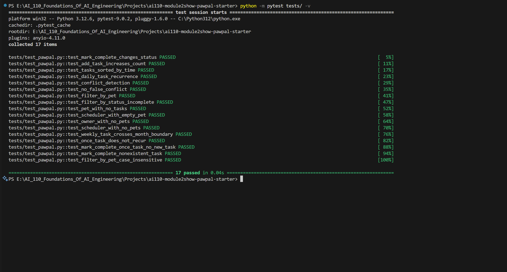
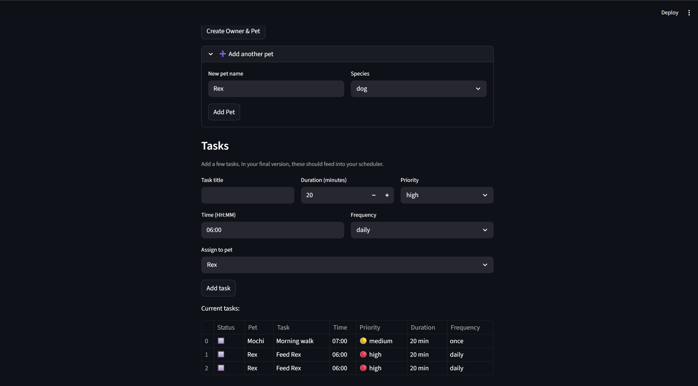
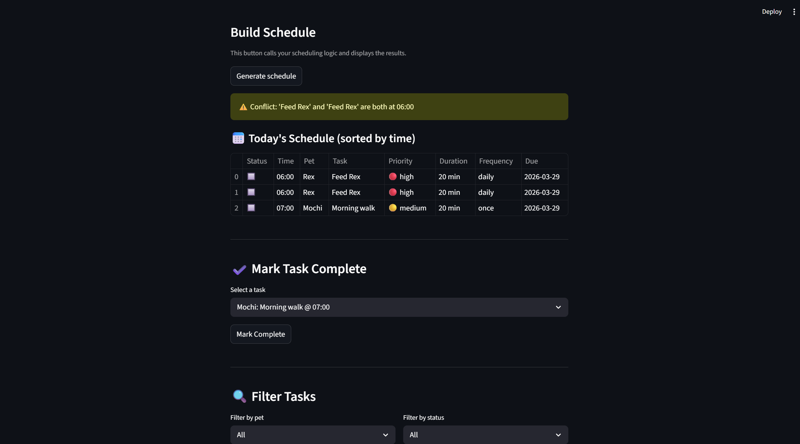
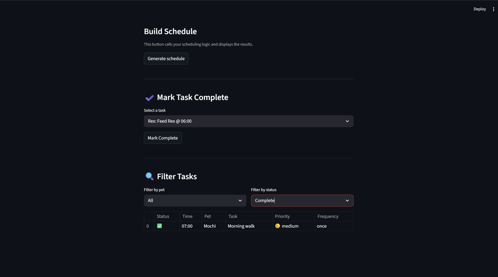

# PawPal+ (Module 2 Project)

**PawPal+** is a Streamlit app that helps a pet owner plan and manage daily care tasks for their pets using object-oriented Python and smart scheduling logic.

---

## Scenario

A busy pet owner needs help staying consistent with pet care. They want an assistant that can:

- Track pet care tasks (walks, feeding, meds, enrichment, grooming, etc.)
- Consider constraints (time, priority, frequency)
- Produce a sorted daily schedule and warn about conflicts
- Auto-reschedule recurring tasks when marked complete

---

## What was built

- **Owner, Pet, Task, Scheduler** classes in `pawpal_system.py`
- A CLI demo in `main.py` to verify backend logic before connecting the UI
- A full Streamlit UI in `app.py` wired to the real backend classes
- An automated test suite with 17 passing tests in `tests/test_pawpal.py`

---

## ✨ Features

- **Time-based sorting** — daily schedule displayed in chronological order
- **Conflict detection** — warns when two tasks share the same start time
- **Recurring tasks** — daily/weekly tasks auto-reschedule when marked complete
- **Filtering** — view tasks by pet name or completion status
- **Priority levels** — tasks tagged 🔴 high / 🟡 medium / 🟢 low

---

## Getting started

### Setup

```bash
python -m venv .venv
source .venv/bin/activate  # Windows: .venv\Scripts\activate
pip install -r requirements.txt
```

### Run the app

```bash
streamlit run app.py
```

### Run the CLI demo

```bash
python main.py
```

---

## 🧪 Testing PawPal+
```bash
python -m pytest tests/ -v
```



**17 tests** covering:

- Core behavior: task completion, task count, sort order, daily recurrence, conflict detection, no false conflicts, pet filter, status filter
- Edge cases: empty pets, owner with no pets, month-boundary rollover, "once" tasks not recurring, nonexistent task handling, case-insensitive filtering

**Confidence level: ⭐⭐⭐⭐⭐ (5/5)**

---

## 🗂️ Project structure

```
pawpal_system.py   ← backend logic (Owner, Pet, Task, Scheduler)
app.py             ← Streamlit UI
main.py            ← CLI demo script
tests/
  test_pawpal.py   ← 17 automated tests
uml_final.png      ← final UML class diagram
reflection.md      ← design and AI collaboration reflection
requirements.txt
```

---

## 📸 Demo

**Owner & pet setup with tasks added:**


**Generated schedule with conflict warning:**


**Filter tasks by pet and status:**

## Smarter Scheduling

PawPal+ goes beyond a simple task list with four algorithmic features:

- **Sorting** — `Scheduler.get_sorted_tasks()` uses Python's `sorted()` with a lambda key on the HH:MM time string to return tasks in chronological order.
- **Filtering** — `filter_by_pet()` and `filter_by_status()` let owners narrow the view to what they need.
- **Conflict detection** — `detect_conflicts()` scans all tasks for shared start times and returns human-readable warning messages instead of crashing.
- **Recurrence** — `Task.next_occurrence()` uses `timedelta` to calculate the next due date for daily and weekly tasks, which are automatically added to the pet's schedule when the current task is marked complete.