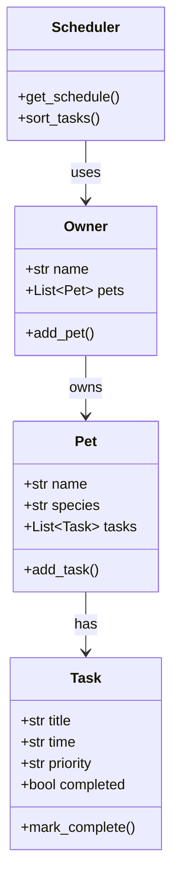

# PawPal+ UML Draft (Phase 1)

This was my initial class diagram before implementation began.

```mermaid
classDiagram
    class Task {
        +str title
        +str time
        +str priority
        +bool completed
        +mark_complete()
    }

    class Pet {
        +str name
        +str species
        +List~Task~ tasks
        +add_task()
    }

    class Owner {
        +str name
        +List~Pet~ pets
        +add_pet()
    }

    class Scheduler {
        +get_schedule()
        +sort_tasks()
    }

    Owner --> Pet : owns
    Pet --> Task : has
    Scheduler --> Owner : uses
```